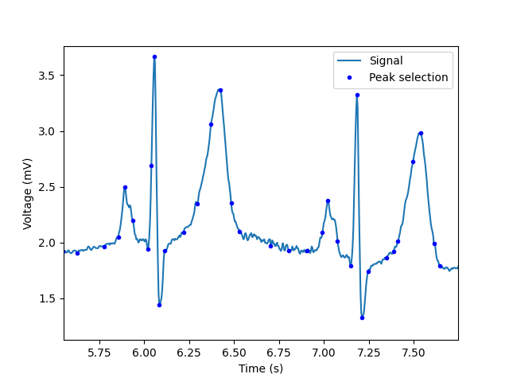
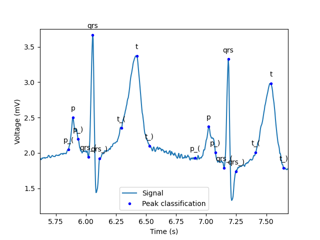

[](https://opensource.org/licenses/MIT)


# Project for ECG fiducial points delineation
This python project is based on LSTM and reinforcement learning for the delineation of Electrocardiogram (ECG) fiducial points. The method is mainly subsectioned to two-step process:

1. [Peak selection](#1-peak-selection)
2. [Peak classification](#2-peak-classification)

## Content
- [Content](#content)
- [Overview](#overview)
  - [1. Peak selection](#1-peak-selection)
  - [2. Peak classification](#2-peak-classification)
- [Application](#application)
  - [1. Prerequisites](#1-prerequisites)
  - [2. Train, validation, and results plot](#2-train-validation-and-results-plot)
- [Customization of the reinforcement learning framework](#customization-of-the-reinforcement-learning-framework)
  - [1. Framework components](#1-framework-components)
  - [2. Required customization](#2-required-customization)
  - [3. Example](#3-example)
    - [3.1. Definitions](#31-definitions)
    - [3.2. Implementation](#32-implementation)
- [License](#license)

## Overview

### 1. Peak selection
Consists of a peak analyzer and a [customizable reinforcement learning framework](#customization-of-the-reinforcement-learning-framework) for automatically adjusting the parameters of the peak analyzer. The results should look as follows:

<p align="center">
  
</p>

### 2. Peak classification
106 features are extracted from each of the selected peaks and 
fed sequencially to an LSTM model for a 10 labels multi-classification. The results should look as follows:

<p align="center">
  
</p>

## Application

### 1. Prerequisites
The code is run on [Python 3.13.7](https://www.python.org/downloads/release/python-3137/) with the following additional dependencies:

- numpy
- tensorflow
- matplotlib
- pywt
- wfdb
  
Running the following line on the terminal will automatically install the dependencies:

````bash
pip install numpy tensorflow matplotlib pywavelets wfdb
````

### 2. Training, validation, and results plot
The implementation of the metod is included in the costructor of the class Test in the file [test.py](./test.py). Running the code below will create or get a model named `cwd_framework_1` from the database; train, validate, and save the model in the database; and plot test results:

````python
from test import Test
test = Test()
````

## Customization of the reinforcement learning framework
### 1. Framework components
The framework consists of:
- [Two neural netwrok models](./cwd_nn.py#L72-L97) (for exploration and exploitation).
- [Q-learning algorithm](./reinforcement_learning.py).
- [Two functions for computing the reward and checking the end of the episode](./cwd_rl_custom.py#L59-L139).

The neural network models are used for reducing the runtime of the agent exploration and the memory consumption with high dimensional environments.<br/>

### 2. Required customization
The customization is required for:
- The definition of the environment dimensions.
- The architecture of the neural networks, which are used for taking the state of the agent as input and outputing the next action or state.
- The reward and episode-end-check functions.<br/>

### 3. Example
#### 3.1. Definitions
This project defines:
- The environment dimensions together with the neural network architecture in [lines 72-97 in file cwd_nn.py](./cwd_nn.py#L72-L97), where the environment is given 2 dimensions as follows:
  ````python
  dimensions_list: list[Dimension] = []
  dimensions_list.append(Dimension(name="AT", size=30, min=1, max=25))
  dimensions_list.append(Dimension(name="ART", size=60, min=0, max=0.3))
  ````
  These 2 dimensions represent the parameters "AT" and "ART" for tuning the peak analyzer. The function "peak analyzer" accepts continuous values for the AT and ART. However, they should be descretized in reinforcement learning to represent the actual state of the "agent". The precision of the agent steps depends on the resolution of the descretization, which is defined with the `size`, `min`, and `max` of the Dimension. However, higher resolution also comes with longer runtime in the agent exploration.<br/>
  The neural network in this project takes 10 values representing the waveform of the signal as input, and outputs 2 values representing the final state of the agent corresponding to the highest reward for the signal. Which means, this neural network is trained for outputing the final state of the agnet's episode, and not the full trajectory of the agnet's exploration in the episode. `The customization here depends on whether the user wants to train the neural network for predicting the actions, states, final state, or the full trajectory of the agent`.
- The reward function is defined in [lines 59-113 in file cwd_rl_custom.py](./cwd_rl_custom.py#L59-L113), and the episode-end-check in [lines 116-139 in file cwd_rl_custom.py](./cwd_rl_custom.py#L116-L139).

#### 3.2. Implementation
The framework is then used as follows:

````python
learning_rate = 0.1
discount = 0.95
env = Environment(dimensions_list, learning_rate, discount, compute_reward, check_if_done)

max_episodes = 3
for episode in range(max_episodes):
  # Predict the initial state of the selected environment
  episode_predicted_output = exploration_model.predict(np.array([features]), verbose=0)

  (q_table_dict, episode_steps, best_state, bad_state) = env.deep_train(episode_predicted_output)

  #--TODO--
  # Train the exploration neural network model if needed.
  # and/or save the exploration data (episode_steps, best_state, bad_state) of the current episode in the database.

#--TODO--
# After finishing all episodes from all environment, train the exploitation neural network model with the best data saved from the exploration.
````
where:
- compute_reward: is the reward function.
- check_if_done: is the episode-end-check function.
- episode_predicted_output: is the initial state of the agent predicted by the exploration model. It's size is the same as the number of dimensions (in this case 2 dimensions), and its values should be from 0 to 1 representing a ratio of the agent's state.
- q_table_dict: is a dictionary representing the reward of each state that the agent has explored. The dictionary keeps developing after every episode.
- episode_steps: is a list representing the sequence of states with their rewards of the agent's exploration in the episode.
- best_state: is the best state in the episode.
- bad_state: is a boolean representing if the exploration of the episode should be avoided. Its value is assigned from `compute_reward` function depending on the user's requirement.

## License
[MIT](https://opensource.org/license/mit)